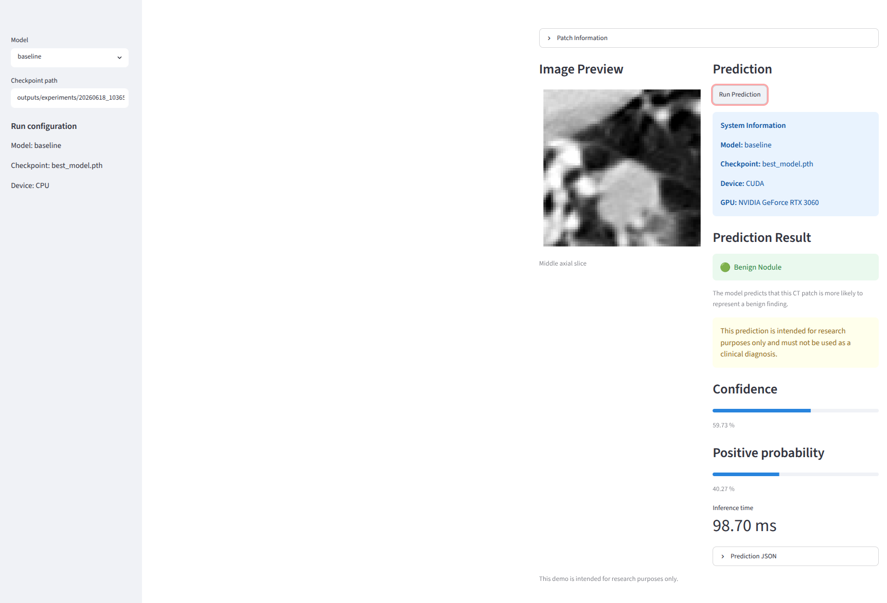

# LUNA16 Lung Nodule Classification (3D CNN + Vision Transformer)

This repository contains PyTorch training utilities and model experiments for
binary lung nodule classification on 3D LUNA16 candidate patches. It includes
baseline convolutional models, residual and multi-scale variants, squeeze-and-
excitation variants, and a small 3D Vision Transformer.

The project is designed as a modular research framework for experimenting with
modern 3D deep learning architectures for medical image analysis.

## Highlights

- 🫁 Lung nodule classification on the LUNA16 dataset
- 🧠 Multiple 3D CNN architectures and a 3D Vision Transformer (ViT3D)
- 📊 ROC curve, AUC, confusion matrix, and benchmark comparison
- 🔬 Interactive Streamlit research demo
- 📦 ONNX export for deployment
- PyTorch training with optional CUDA acceleration
- ✅ 55 automated tests

The LUNA16 dataset is not included in this repository. Place the dataset under
the expected `data/raw/LUNA16` layout before running training.

## Model Architectures

- Baseline3DCNN
- Residual3DCNN
- ResidualSE3DCNN
- MultiScale3DCNN
- MultiScaleSE3DCNN
- VisionTransformer3D

## Supported Models

- `baseline`
- `residual`
- `residual_se`
- `multiscale`
- `multiscale_se`
- `vit3d`

## Training

Run a debug training pass with one of the supported models:

```bash
python scripts/train.py --model baseline
python scripts/train.py --model residual
python scripts/train.py --model residual_se
python scripts/train.py --model multiscale
python scripts/train.py --model multiscale_se
python scripts/train.py --model vit3d
```

The training script currently uses a debug configuration with `max_batches=5`
for training and validation.

## Experiment Outputs

Each training run writes outputs to a unique experiment directory:

```text
outputs/experiments/<timestamp>_<model>/
  checkpoints/
  metrics/
  figures/
  results_json/
```

These directories contain the best checkpoint, training history JSON, training
history plot, and benchmark JSON for the run.

## TensorBoard

Every experiment automatically writes TensorBoard logs into:

```text
outputs/experiments/<timestamp>_<model>/tensorboard/
```

View all experiment logs with:

```bash
tensorboard --logdir outputs/experiments
```

TensorBoard provides interactive visualization of:

- Training loss
- Validation loss
- Training accuracy
- Validation accuracy
- Learning rate

Open the URL displayed by TensorBoard (typically http://localhost:6006) in your web browser.

## Benchmark Summary

Summarize saved experiment benchmark JSON files with:

```bash
python scripts/summarize_benchmarks.py
```

The script prints a table and writes:

```text
outputs/benchmark_summary.csv
outputs/benchmark_summary.md
```

## Streamlit Demo

### Demo



Install dependencies and start the local demo app:

```bash
pip install -r requirements.txt
streamlit run app/streamlit_app.py
```

Open the app at:

```text
http://localhost:8501
```

The demo provides:

- Built-in positive and negative example patches
- Custom `.npy` patch upload
- Model and checkpoint selection
- Single-patch inference
- Confidence and probability scores
- ROC curve and confusion matrix visualization

## Tests

Run the test suite with:

```bash
pytest
```

## Features

- Multiple 3D CNN architectures
- 3D Vision Transformer (ViT3D)
- Experiment manager
- Model factory
- Checkpoint manager
- Early stopping
- Automatic benchmark export
- Training history visualization
- Comprehensive unit tests

## Requirements

- Python 3.12
- PyTorch
- MONAI
- SimpleITK
- NumPy
- Matplotlib

## Results

Benchmark comparison will be added as experiments are completed.
